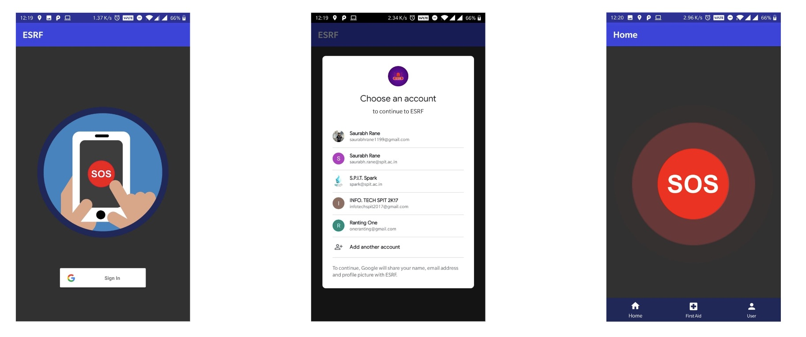
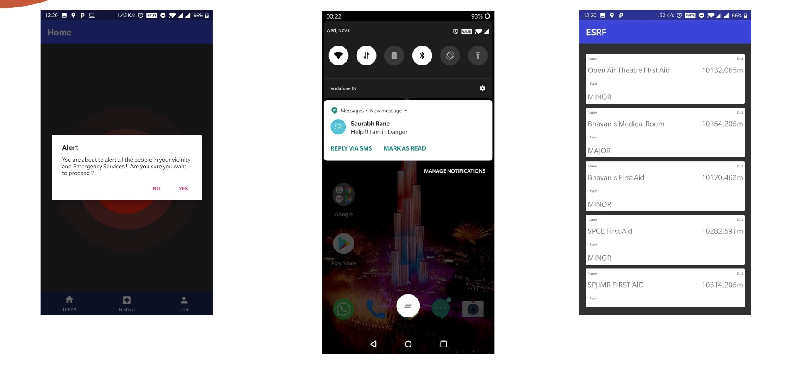
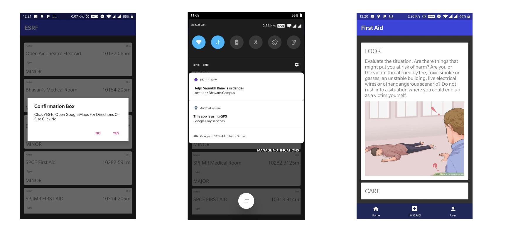

# Emergency-Situation-Responder

  

## An Android app to faciliatate alerting of incidents on property(factory, university, office space) in order to provide urgent attention. The App helps the security team to view and respond to all the alerts

## Tech Stack
1. Java
2. Firebase
3. Android ASDK
4. Geohashing - proximity calculation

